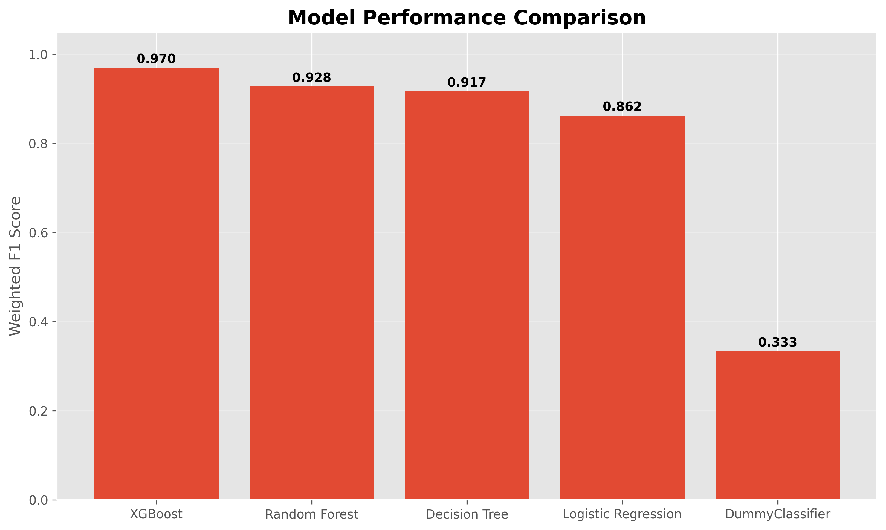
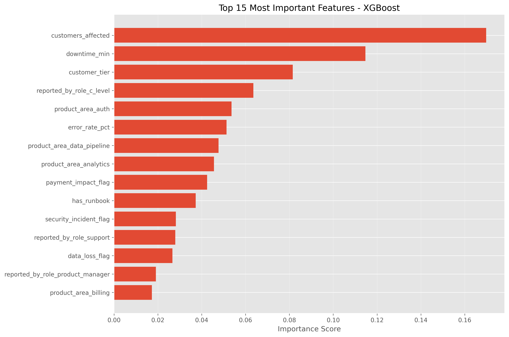
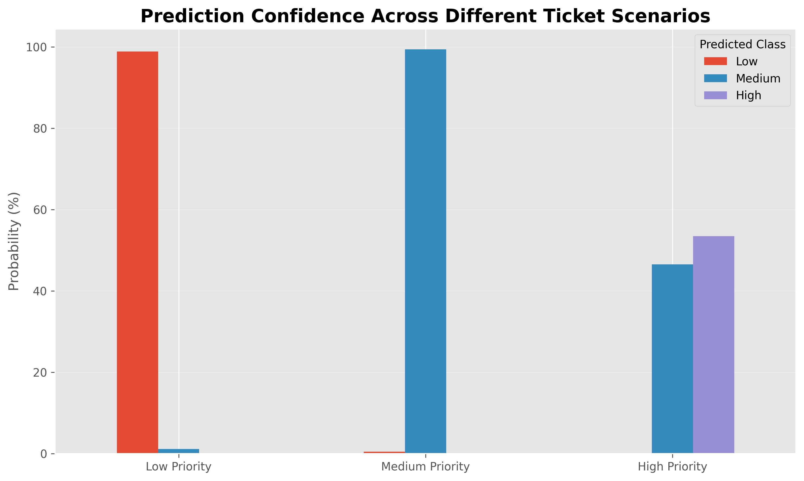
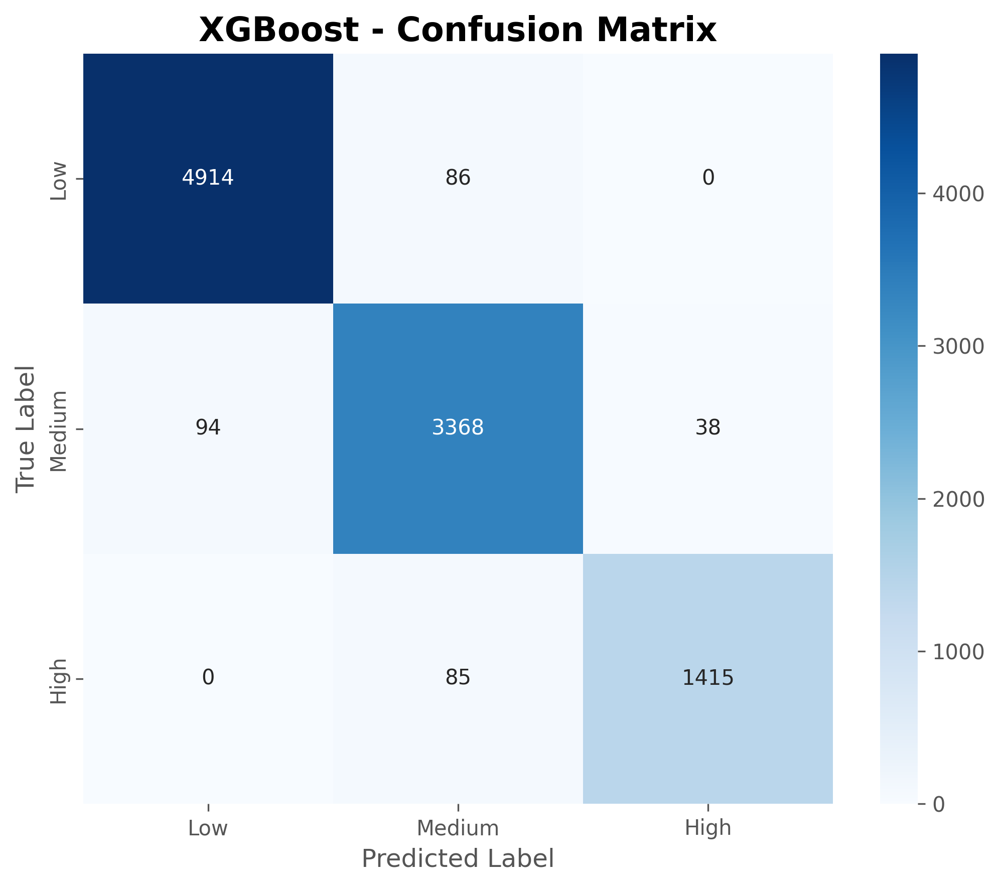

# IT Support Ticket Priority Prediction

> End-to-end Machine Learning project that predicts the priority level of IT support tickets using ML Models.

## Project Description

Efficient ticket and task prioritization is essential for IT support teams. Misclassifying critical incidents can lead to increased downtime, financial losses, SLA violations, and poor customer experience.

This project develops a multiclass classification model capable of automatically predicting whether an IT support ticket should be classified as **Low**, **Medium**, or **High** priority based on operational, technical, and customer-related information.

The project covers the complete Machine Learning workflow, including:

- Exploratory Data Analysis (EDA)
- Data Cleaning & Preprocessing
- Feature Engineering
- Feature Scaling
- Model Training & Evaluation
- Feature Importance Analysis
- Model Inference on New Tickets

The final model is based on **XGBoost**, achieving an overall accuracy of **96.97%** on unseen data.

## Business Problem

Large organizations receive thousands of IT support tickets every day.

Incorrect ticket prioritization can cause:

- Longer response times
- SLA breaches
- Higher operational costs
- Poor customer satisfaction
- Delayed resolution of critical incidents

This project demonstrates how Machine Learning can automate ticket prioritization, helping support teams respond faster and allocate resources more efficiently.

## Dataset

The dataset contains **50,000 simulated IT support tickets** from different industries, regions, customer tiers, and product areas.

###  Target Variables to work

| Priority |
|----------|
| Low |
| Medium |
| High |

### Main Features

- Company Size
- Customer Tier
- Industry
- Region
- Booking Channel
- Product Area
- Number of Affected Customers
- Downtime Duration
- Error Rate
- Security Incident
- Payment Impact
- Customer Sentiment
- User Role Reporting the Incident

## Project Workflow

The project follows a complete end-to-end Machine Learning pipeline, from raw data exploration to model inference.

```text
                     IT Support Tickets Dataset
                               │
                               ▼
                 Exploratory Data Analysis (EDA)
                               │
                               ▼
              Data Cleaning & Missing Value Handling
                               │
                               ▼
                  Feature Engineering & Encoding
                               │
                               ▼
                      Feature Scaling
                               │
                               ▼
                     Train / Test Split
                               │
                               ▼
          Model Training & Performance Evaluation
                               │
        ┌──────────┬──────────┬──────────────┬──────────────┐
        ▼          ▼          ▼              ▼
   Logistic    Decision    Random       XGBoost
  Regression     Tree       Forest
        │          │          │              │
        └──────────┴──────────┴──────────────┘
                               │
                               ▼
                  Best Model Selection (XGBoost)
                               │
                               ▼
                 Feature Importance Analysis
                               │
                               ▼
                   Save Trained Model (.pkl)
                               │
                               ▼
                     Predict New Support Ticket
```

The project is organized into four Jupyter notebooks:

| Notebook | Description |
|----------|-------------|
| `01_eda.ipynb` | Exploratory Data Analysis and business insights |
| `02_data_preprocessing.ipynb` | Data cleaning, feature engineering, encoding, scaling, and train/test split |
| `03_model_training.ipynb` | Model training, evaluation, comparison, and feature importance |
| `04_model_inference.ipynb` | Load the trained model and predict the priority of new support tickets |

## Project Structure

```text
IT-Support-Ticket-Priority-Prediction
│
├── data
│   ├── processed
│   │   ├── X_train.csv
│   │   ├── X_test.csv
│   │   ├── y_train.csv
│   │   ├── y_test.csv
│   │   └── Support_tickets.csv
│
├── models
│   ├── scaler.pkl
│   └── xgboost_model.pkl
│
├── notebooks
│   ├── 01_eda.ipynb
│   ├── 02_data_preprocessing.ipynb
│   ├── 03_model_training.ipynb
│   └── 04_model_inference.ipynb
│
├── reports
│   └── figures
│
├── README.md
├── requirements.txt
└── .gitignore
```

### Folder Description

| Folder | Purpose |
|---------|---------|
| **data/** | Stores the processed datasets used during training and evaluation. |
| **models/** | Contains the trained XGBoost model and the fitted StandardScaler. |
| **notebooks/** | Jupyter notebooks covering the complete machine learning workflow. |
| **reports/** | Stores generated figures and visualizations used in the README. |
| **README.md** | Project documentation. |
| **requirements.txt** | Python dependencies required to reproduce the project. |
| **.gitignore** | Files and folders excluded from version control. |

##  Exploratory Data Analysis (EDA)

The first stage of the project focused on understanding the dataset and identifying patterns that could influence ticket priority.

The analysis included:

- Dataset structure inspection
- Data type validation
- Missing value analysis
- Target variable distribution
- Numerical feature distributions
- Categorical feature analysis
- Correlation analysis
- Business-oriented insights

### Main Findings

- The dataset contains 50,000 support tickets**.
- The target variable is moderately imbalanced:
  - **Low:** 50%
  - **Medium:** 35%
  - **High:** 15%
- Only one feature (`customer_sentiment`) contained missing values (~1.8%).
- Larger customer impact and longer downtime were strongly associated with higher ticket priority.
- Security incidents and payment-impact flags showed a clear relationship with critical tickets.

The exploratory analysis guided the preprocessing strategy and confirmed that the dataset was suitable for supervised machine learning.

## Data Preprocessing

The preprocessing pipeline was designed to prepare the dataset for machine learning while preventing data leakage.

### Steps Performed

- Missing value handling
- Feature engineering
- One-Hot Encoding for nominal categorical variables
- Ordinal Encoding for ordered categories
- Standardization of numerical variables using **StandardScaler**
- Train/Test split (80/20)
- Saving processed datasets and preprocessing artifacts

### Output

- Training samples: 40,000
- Testing samples: 10,000
- Final feature set: 49 features

The fitted `StandardScaler` was exported as a `.pkl` file to ensure consistent preprocessing during inference.

##  Model Training

Five classification models were trained and evaluated to identify the best-performing solution for predicting ticket priority.

The workflow included:

- Dummy Classifier (Baseline)
- Logistic Regression
- Decision Tree
- Random Forest
- XGBoost

Each model was evaluated using:

- Accuracy
- Precision (Weighted)
- Recall (Weighted)
- F1-Score (Weighted)
- Training Time

##  Model Performance

| Model | Accuracy | Precision | Recall | F1 Score | Training Time (s) |
|------|---------:|----------:|--------:|----------:|------------------:|
| Dummy Classifier | 0.5000 | 0.2500 | 0.5000 | 0.3333 | 0.0034 |
| Logistic Regression | 0.8630 | 0.8625 | 0.8630 | 0.8624 | 0.2392 |
| Decision Tree | 0.9169 | 0.9172 | 0.9169 | 0.9170 | 0.1472 |
| Random Forest | 0.9280 | 0.9289 | 0.9280 | 0.9278 | 0.7103 |
| **XGBoost**  | **0.9697** | **0.9698** | **0.9697** | **0.9697** | **1.0761** |



*Figure 2. Performance comparison of the evaluated machine learning models.*

### Best Model

XGBoost achieved the highest performance across all evaluation metrics, obtaining an overall accuracy of 96.97% while maintaining excellent precision, recall, and F1-score.

Although XGBoost required slightly longer training time than simpler models, the performance improvement justified selecting it as the final production model.

##  Feature Importance

One advantage of XGBoost is its ability to estimate the importance of each feature used during prediction.

The analysis shows that the model primarily relies on operational and business-impact variables rather than categorical information.

The most influential features include:

1. Customers Affected
2. Downtime Duration
3. Customer Tier
4. Reported By (C-Level)
5. Product Area
6. Error Rate
7. Payment Impact
8. Security Incident

These results are aligned with real-world IT support operations, where incidents affecting many customers or causing extended downtime require immediate attention.

> **Figure 1.** Top 15 Most Important Features.



## Model Inference

The final stage of the project demonstrates how the trained model can be used to predict the priority of new IT support tickets.

The inference pipeline performs the following steps:

1. Load the trained XGBoost model.
2. Load the fitted StandardScaler.
3. Create a new support ticket.
4. Apply the same preprocessing used during training.
5. Predict the ticket priority.
6. Calculate prediction probabilities.
7. Provide a business interpretation of the result.

This notebook simulates how the model could be integrated into a production environment where new tickets are continuously received.

Example prediction:

| Ticket | Predicted Priority | Confidence |
|---------|-------------------|-----------:|
| New Support Ticket | **High** | **99.99%** |

## Prediction Confidence

This chart shows the probability assigned by the model to each class for a sample ticket.



## XGBoost Confusion Matrix



## Technologies Used

| Category | Technologies |
|----------|--------------|
| Programming Language | Python 3.13 |
| Data Analysis | Pandas, NumPy |
| Data Visualization | Matplotlib, Seaborn |
| Machine Learning | Scikit-learn, XGBoost |
| Model Serialization | Joblib |
| Development Environment | Jupyter Notebook, VS Code |
| Version Control | Git & GitHub |

## How to see the project work

### 1. Clone the repository

```bash
git clone https://github.com/YOUR_USERNAME/IT-Support-Ticket-Priority-Prediction.git
```

### 2. Navigate to the project

```bash
cd IT-Support-Ticket-Priority-Prediction
```

### 3. Create a virtual environment

```bash
python -m venv venv
```

### 4. Activate the virtual environment

**macOS / Linux**

```bash
source venv/bin/activate
```

**Windows**

```bash
venv\Scripts\activate
```

### 5. Install dependencies

```bash
pip install -r requirements.txt
```

### 6. Open Jupyter Notebook

```bash
jupyter notebook
```

Open the notebooks in numerical order:

1. `01_eda.ipynb`
2. `02_data_preprocessing.ipynb`
3. `03_model_training.ipynb`
4. `04_model_inference.ipynb`

## Future Improvements

Potential future enhancements include:

- Hyperparameter tuning using RandomizedSearchCV or Optuna.
- Deployment as a Streamlit web application.
- Containerization using Docker.
- Model monitoring for production environments.
- Explainability using SHAP values.
- Continuous model retraining with new ticket data.

## Author

**Eduardo Torres**

AI Engineer and Data Analyst, with experience in technical support, cloud technologies, and predictive analytics.

- GitHub: *edut1228-IA*
- LinkedIn: *https://www.linkedin.com/in/eduardo-torres-a6208a365/*